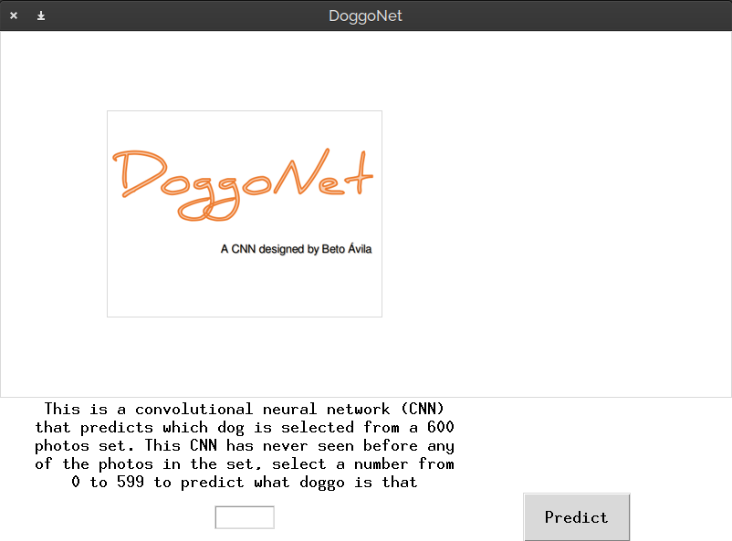

# DoggoNet

This is a CNN for image clasification of 4 dogs using a set of 4000 pictures

This code is divided in 4 stages: 
1. Image preprocessing
2. Creation of numpy datasets
3. Model definition, testing and fitting using Keras
4. GUI creation to implement model using tkinter

## 1. Image processing
This part rotates and resizes the images to a suitable image size to be
computed swiftly. 300x225 px is the size selected and all images are
rotated to be in a horizontal view. This part only uses PIL and os 
modules.

## 2. Creation of numpy datasets
This section creates train and test sets in .npz format files to store
the pictures and to prevent recalculation of datasets.

## 3. Model definition, testing and fitting using Keras
I created the following architecture:

|Layer|(type)|Output Shape|Param|
| --- | --- | --- | --- |
|conv2d|(Conv2D)|(None, 215, 290, 64)|23296
max_pooling2d|(MaxPooling2D)|(None, 53, 72, 64)|0
conv2d_1|(Conv2D)|(None, 47, 66, 48)|150576
max_pooling2d_1|(MaxPooling2|(None, 15, 22, 48)|0
conv2d_2|(Conv2D)|(None, 13, 20, 32)|13856
max_pooling2d_2|MaxPooling2|(None, 6, 10, 32)|0
flatten|(Flatten)|(None, 1920)|0
dropout|(Dropout)|(None, 1920)|0
dense|(Dense)|(None, 64)|122944
dense_1|(Dense)|(None, 64)|4160
dense_2|(Dense)|(None, 64)|4160
dense_3|(Dense)|(None, 4)|260

Total params: 319,252

Trainable params: 319,252

Non-trainable params: 0

I also used Adam optimizer with the following parameters
(which could be tuned and improved):
`
opt = keras.optimizers.Adam(learning_rate=0.0013, 
beta_1=0.87, beta_2=0.9, epsilon=1.9e-07)`

It achieved from 97% to 99% accuracy. Other architectures (more 
sophisticated) were not tested due to hardware limitations.

## 4. GUI creation to implement model using tkinter
To show the results I created a simple GUI using tkinter

